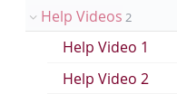

# ProcessHelpVideos Module
**A Process module to display help videos for the ProcessWire CMS. It can be used to make help videos (screencasts) available to content editors.**
- This module adds a 'Help Video" section to the ProcessWire backend. The help videos are accessible through an automatically created page in the Admin page tree.  
- You can add your help videos as pages in the page tree. 
- The module adds a hidden page to the page tree that acts as parent page for the help video pages.
-  
- All necessary fields and templates will be installed automatically.
- If there are already a CKEditor field and/or a file field for mp4 files installed in the system, the module will use those. Otherwise it will create the necessary fields.
- Also the necessary templates for the parent help videos page and it's children are created on module install.
- The module installs a permission *process-helpvideos*. Every user role that should have access to the help video section, needs this permission.

## System requirements
This version of ProcessHelpVideos is designed for ProcessWire 3.x or newer and PHP >= 7.0. 

## How to use this module
1. Install the module
2. Add the permission *process-helpvideos* to all roles that should have access to the help video section. 
3. Adjust permissions for the help video templates as you see fit.
4. Adjust the title of the *Help Videos* page as you see fit.
5. Adjust the title of the page *Help Videos* under the Admin page tree to amend the title of the link to the help section in the PW main navigation
6. Produce some screencasts in mp4 format
7. Add pages to the parent page *Help Videos* in the page tree. Save videos (screencasts) and their descriptions to those pages.

## Video files format
The videos uploaded should be in **mp4** format which has the widest [browser support among modern browsers](https://caniuse.com/#feat=mpeg4).

## Frameworks used
- [video JS](https://videojs.com/) for handling video display and playback
- the module is designed to play nicely with thAdminThemeUIkit. But it should also render fine with other admin themes.

### Todos
- add module config option to allow removal of all help video pages, their templates and fields that were installed by this module and are not being used by other templates. 
- add module config option to remove help video parent page from page tree for user roles without permission to edit help videos
